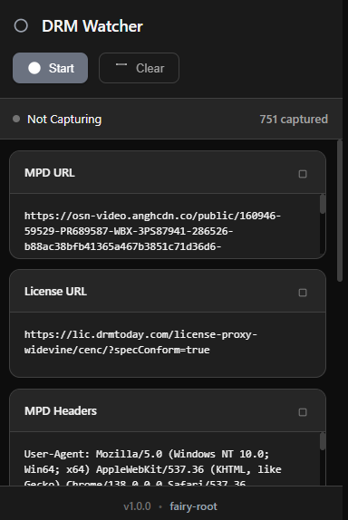

# DRM Watcher

<div align="center">
  
</div>

**DRMWatcher: A powerful Chrome extension for capturing and analyzing DRM-related network traffic for security testing and educational purposes.**

<div align="center">
  
</div>

---


## Features

### Network Traffic Monitoring
- **Real-time Capture**: Monitor all network requests in real-time
- **DRM Detection**: Automatically detect MPD files, license requests, and other DRM-related traffic
- **Multi-format Support**: Supports DASH (.mpd), HLS (.m3u8), Widevine, PlayReady, and FairPlay

### Data Extraction
- **MPD URLs**: Capture manifest URLs for DASH streams
- **License URLs**: Detect and capture DRM license server endpoints
- **HTTP Headers**: Extract request and response headers
- **Cookies**: Capture session cookies for authenticated requests
- **PSSH Data**: Automatically extract Protection System Specific Header data from MPD files

### User Interface
- **Dark Theme**: Modern dark interface with blue accents
- **Copy to Clipboard**: One-click copy for all captured data
- **Real-time Updates**: Live updates as data is captured
- **DevTools Integration**: Additional network monitoring panel in Chrome DevTools

### Advanced Features
- **Background Monitoring**: Continues capturing even when popup is closed
- **Data Persistence**: Automatically saves captured data
- **Export Functionality**: Export all data as structured JSON
- **Request Filtering**: Focuses only on DRM-related requests

## Installation

### Method 1: Load Unpacked Extension (Development)
1. Open Chrome and navigate to `chrome://extensions/`
2. Enable "Developer mode" in the top right
3. Click "Load unpacked" and select the `DRMWATCHER` folder
4. The extension will appear in your extensions list

### Method 2: Chrome Web Store (When Published)
- Search for "DRM Watcher" in the Chrome Web Store
- Click "Add to Chrome"

## Usage

### Basic Operation
1. **Start Capturing**: Click the "Start Capture" button to begin monitoring
2. **Browse Content**: Navigate to websites with DRM-protected content
3. **View Results**: Captured data appears automatically in the respective fields
4. **Copy Data**: Use the copy buttons to clipboard copy any captured data
5. **Stop Capturing**: Click "Stop Capture" when finished

### Data Fields Explained

#### MPD URL
- The manifest URL for DASH streams
- Contains stream information and metadata
- Usually ends with `.mpd`

#### License URL
- DRM license server endpoint
- Used to request content decryption keys
- Often contains keywords like "license", "widevine", or "lic"

#### Headers (MPD & License)
- HTTP request headers in JSON format
- Includes User-Agent, Referer, Authorization, etc.
- Essential for reproducing requests

#### Cookies
- Session cookies organized by domain
- Required for authenticated requests
- Formatted as `name=value` pairs

#### PSSH Data
- Protection System Specific Header
- Base64-encoded DRM initialization data
- Automatically extracted from MPD files

#### All Data
- Complete export of all captured data
- Structured JSON format
- Includes timestamp and metadata

### DevTools Integration
1. Open Chrome DevTools (F12)
2. Navigate to the "DRM Watcher" tab
3. View detailed network request logs
4. Export comprehensive request data

## Technical Details

### Architecture
- **Background Script**: Service worker for persistent monitoring
- **Content Script**: Injected into web pages for deep inspection
- **Popup Interface**: Main user interface
- **DevTools Panel**: Advanced network monitoring

### Supported DRM Systems
- **Widevine**: Google's DRM system
- **PlayReady**: Microsoft's DRM system
- **FairPlay**: Apple's DRM system (basic detection)
- **Common Encryption (CENC)**: Industry standard

### Detection Methods
- **URL Pattern Matching**: Detects DRM-related URLs
- **Content Analysis**: Inspects response content for PSSH data
- **API Interception**: Monitors DRM API calls
- **Header Analysis**: Identifies DRM-specific headers

## Security & Privacy

### Data Handling
- **Local Storage Only**: All data stored locally in browser
- **No External Transmission**: Data never sent to external servers
- **User Control**: Users control all data capture and export

### Permissions Explained
- **webRequest**: Monitor network requests
- **storage**: Save captured data locally
- **activeTab**: Access current tab information
- **cookies**: Read session cookies
- **tabs**: Basic tab information

## Legal Disclaimer

⚠️ **IMPORTANT**: This extension is designed for:
- **Educational purposes**
- **Security research**
- **Legitimate penetration testing**
- **Understanding DRM technologies**

**NOT for**:
- Circumventing DRM protection
- Piracy or copyright infringement
- Unauthorized content access
- Any illegal activities

Users are responsible for compliance with applicable laws and regulations.

## Development

### File Structure
```
DRMWATCHER/
├── manifest.json          # Extension configuration
├── background.js          # Service worker (main logic)
├── content.js            # Content script (page injection)
├── popup.html            # Main UI
├── popup.css             # Styling (dark theme)
├── popup.js              # UI logic
├── devtools.html         # DevTools page
├── devtools.js           # DevTools integration
├── devtools-panel.html   # DevTools panel UI
├── devtools-panel.js     # DevTools panel logic
├── icons/                # Extension icons
└── README.md             # This file
```

### Key Components

#### Background Script (`background.js`)
- Monitors network requests using `webRequest` API
- Detects DRM-related traffic patterns
- Extracts and stores relevant data
- Manages extension state

#### Content Script (`content.js`)
- Injects into web pages
- Intercepts JavaScript API calls
- Monitors media element events
- Detects client-side DRM usage

#### Popup Interface (`popup.html/js/css`)
- Main user interface
- Real-time data display
- Copy-to-clipboard functionality
- Dark theme with blue accents

### Building & Testing
1. Make changes to source files
2. Reload extension in `chrome://extensions/`
3. Test on DRM-protected content
4. Verify data capture and UI functionality

## Troubleshooting

### Common Issues

#### Extension Not Loading
- Ensure all files are present
- Check console for errors in DevTools
- Verify manifest.json syntax

#### No Data Captured
- Ensure "Start Capture" is clicked
- Check if website uses DRM
- Verify site permissions

#### Copy Function Not Working
- Check clipboard permissions
- Try different browser settings
- Verify HTTPS context

### Debug Mode
1. Open `chrome://extensions/`
2. Find DRM Watcher extension
3. Click "Details"
4. Enable "Allow in incognito" if needed
5. Check "Inspect views" for debugging

## Contributing

### Bug Reports
- Use GitHub Issues
- Include browser version
- Provide reproduction steps
- Include error messages

### Feature Requests
- Describe use case
- Explain expected behavior
- Consider security implications

### Development Setup
1. Clone repository
2. Make changes
3. Test thoroughly
4. Submit pull request

## Changelog

### v1.0.0 (Initial Release)
- Basic DRM traffic monitoring
- MPD and license URL capture
- Header and cookie extraction
- PSSH data extraction
- Dark theme UI
- DevTools integration
- Export functionality

## Donation

Your support is appreciated:

-   **USDt (TRC20)**: `TGCVbSSJbwL5nyXqMuKY839LJ5q5ygn2uS`
-   **BTC**: `13GS1ixn2uQAmFQkte6qA5p1MQtMXre6MT`
-   **ETH (ERC20)**: `0xdbc7a7dafbb333773a5866ccf7a74da15ee654cc`
-   **LTC**: `Ldb6SDxUMEdYQQfRhSA3zi4dCUtfUdsPou`

## Author

-   **GitHub**: [FairyRoot](https://github.com/fairy-root)
-   **Telegram**: [@FairyRoot](https://t.me/FairyRoot)

## Contributing

If you would like to contribute to this project, feel free to fork the repository and submit pull requests. Ensure that your code follows the existing structure, and test it thoroughly.

## License

This project is licensed under the MIT License - see the [LICENSE](LICENSE) file for details.

---

**Remember**: Use responsibly and in compliance with applicable laws and terms of service.